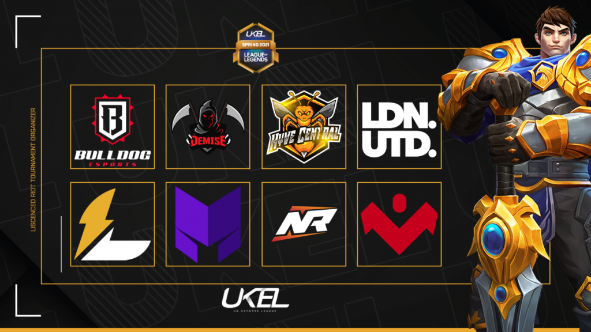

##### Thoughts
One of the hardest things I've had to do for the 2020, is the assembly of the UKEL Spring 2021 roster. There have been a lot of moving parts, a lot of players to scout and a lot of nights, wondering if I've picked the right players. Back at August, fury and anger about losing out to the UKLC and how Resolve would get their before I would, put me in a low. I remember it very well. I had a certain amount of belief the 2020 UKEL Summer team could slip out a 2nd place, to battle against Barrage. I looked at the best of people without looking at the full picture. 

Wanting to make a team, I gave the players a challenge which was achievable but only if they really wanted it. In recollection of these thoughts, I now see the error of my ways. It was my misunderstanding of the environment I created within the team. I burned out the team. I broke their will. I fell into the rabbit hole and kept going down. I mismanaged the team. 

One of the things I seem to do is create a low of mistakes and I can certainly number them. It would take a pen and paper though because my hands wouldn't be able to contain the mistakes that I've committed. Thankfully, I usually find these mistakes that I've made and learn from them. These recollections, even the writing of these posts on a blog that only a select certain people will ever read, helps me see the error of my ways. It helps me find solutions to problems. It's experience. I can learn from my experiences and become better and I will. 

##### I've built a UKEL winning team
Built on the motivations on August, JonnyREcco was the only player that was maintained on the team. This would be the rock and pivot that I could work with, the base of the success of the team. It would be a jungle focused team so that Jonny could be the success the team needed.

The plan of making an absolute monster of a team went to pieces after I started to compete again. The CoD1 Legends tournament was a great thing for me. It made me understand what it was to compete at the highest levels again and it felt great. It also gave me perspective and I believe that's when the penny dropped. I had burnt out my players. I also enjoyed the process of building players and giving people a chance. It's what esports is built on. Chances. I wanted to continue that. 

After testing some high ELO players at a moderate level, I decided extremely quickly that previous experience from Viperio would be needed. Sykes and Kazz came into mind. The base was looking good but we needed a support which could operate with Kazz. Sykes certainly looked better but it seems like Sykes wants to be good at the game but I'm not sure if he wants to competitively be good. League of Legends can cater for both. I hope he finds his happiness. 

It became obvious that I needed to look for a new mid and this was forced onto me. I believed this was going to be the hardest part. Before that, I had figured a good team which could win the UKEL. That would be. 

1) Davy
2) JonnyREcco
3) Sykes 
4) Kazz
5) Hasse

The team had promise to do well in the UKEL. In a haste to make the team, I could see this team working but as days went in, Sykes would force my hand to look for a new midlaner. At this point, it became extremely obvious that I would not be able to find a UK midlaner and therefore had to resort to a UK toplaner. This felt very hard to achieve but thankfully, Viperio helped and maybe a voice clip I did. 

Luck would have it that Jack "in4" would be interested with the team. Originally I thought his quietness would be a problem but over time, his mechanics became a lot more obvious and the fact he was over 300LP. It became obvious that in4 would become a heavy part of the team because of his quietness. While in most cases this would be a terrible idea, for the iteration of the team I was thinking about, it was absolutely possible to make work. As long as in4 could mechanically play to his own game, it was truly a one versus world game for him. Jack would be what we wanted Zooky to be. After a talk with Jonny, we extended an invitation to Jack. This will be the lineup find of the split for the UKEL. 

The biggest challenge Viperio has had since the UKEL 2019 Summer Split, would be to find a solid midlaner. We've moved from many midlaners and we've had problems with many of them. I was generally worried that this would be the weakest point of the team. Luck would come in again. We would find B3rry and Marcus. 

To not make this post any longer, this was a hard choice as both players offer something different;

- B3rry played consistently throughout his whole tryout. There wasn't a time where you would regret choosing him. He made sure to play solid control mages and showed his ability to play carrys when needed. This felt more like a team problem to work with him rather than B3rry's willingness to put his own motives aside and to aid the team. B3rry has what it takes to play in the UKEL and could easily be put into any roster. I hope he finds a team. 
- - -
- Marcus showed very different skills and qualities. Shoutcalling, game IQ and a different perspective. Kazz wants to play for the maximum but Marcus wants to play for the win. Marcus is a more skillful player that we can actually rely on but he's willing to put himself aside for the success for the team. If you needed another element of how Viperio would win a game, you could go with Marcus. Ultimately, it was a question of skill and confidence.

##### Working with the UK Scene

As it can be made obvious, I'm not the most talkative person within the UK scene. I used to talk a lot and it's something I want to do again. To find my voice. Right after this post, I'll post a lot of crap and get a lot of cringe. I need to be who I am. I need to be me and I'll do that. 

Nvision and Barrage showed interest with the players I had interest with. Instead of forcing the players to join Viperio, it was best to come up with a model within Viperio so that it was beneficial for both Viperio and the players, to help them find the best teams. The model was simple

1) If a player played successfully for Viperio, help him find a great team when he wants to.
2) Find out as early as possible so to find them the best team they wish to join if possible.
3) Operate as their agent to get them to the team in question if it were possible. 
4) Move on.

This process might seem extremely retarded and it might be but it's the way I want to do things. It'll help players in the team get to better pastures and that's ultimately what I want to do as a manager. I want to make sure players can get to the best teams as possible and if it meant losing out best players. So be it. I want Viperio to be known as the team that gives players the best chance out of any other team because we give a damn. This strategy allows us to pickup the best players as long as we make the players look great and have them ready for better teams. It's a win win for us. 

We therefore worked with Barrage for Jonny and Nvision for Marcus. I found it extremely weird that Jonny was looked over. I'm expecting Noname to be Barrage or a similar team. There's talent to be had with Noname but I have little to no interest to work with him. I want to work with Jonny and see how far he can go. He's a good lad. Marcus would want to do tryouts for Nvision. As much as I wanted to work with him immediately and not lose out to him, ultimately it was best for us to work with Nvision to give him the best chance possible to join Nvision. We had to make sure all doubt was removed from him. If he had joined Nvision, I would have been slightly worried but then we had B3rry to fallback on. Unfortunately Marcus didn't get to Nvision but that meant Marcus was available. Our team would be;

1) in4
2) JonnyREcco
3) Marcus
4) Kazz
5) Hasse

I am very confident with this team and the only thing that annoys me now, is the waiting of other players. I am happy that Viperio have been able to secure these players and I am to do the best for these guys. Nvision would be the easier of the two teams to work with. Vortex is a standout guy. Froomie did get back to me when requested but it felt a little "business like". Regardless, both teams helped with this process and I've got what I wanted out of it. 

The UKEL 2021 Spring split begins in one month and I'm excited. I will do my best to make sure this team gets into the UKEL and if that means spending my own capital, then so be it. I want the best for my guys. 
