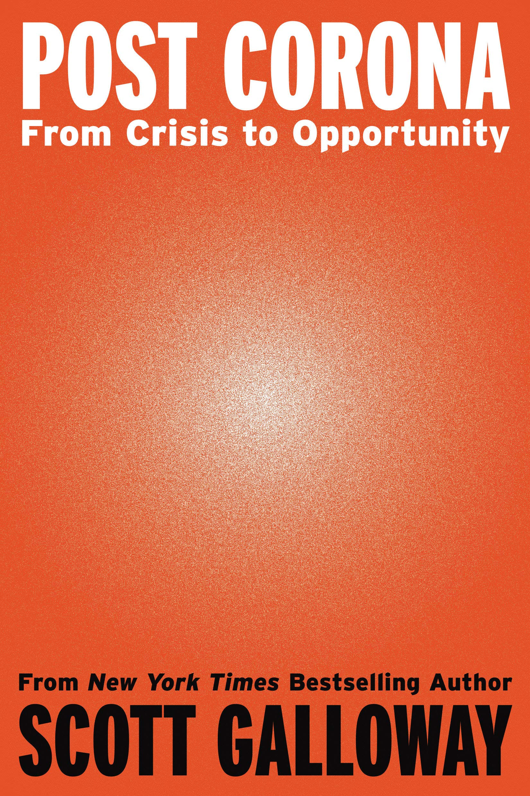

I decided that I should start reading books again and trying to smarten up. I stopped doing this because of my lack of ability to remember what I had read. I now see this as being wrong for most of the things worth remembering, I can remember. 

I've been reading [Scott Galloways, Post Corona](https://www.amazon.co.uk/Post-Corona-Opportunity-Scott-Galloway/dp/1787634809), and I think it showcases a lot of issues which is currently happening in society. To be quick, a lot of people are investing in companies visioning what those companies are in the future, therefore allowing these companies not to function as per profit companies. They effectively are being kept from crashing because enough investors will keep paying the costs of the business. 

I would need to look at the balance sheets for many of these companies. To be totally honest, I probably need to become a better understood with the finances an esports team operates with but it actually one of the reasons to why I didn't invest in FNATIC. I have no real idea of how the business actually makes it's money bar the selling of products and sponsors. I have seen G2 sell a lot of it's merch including 100 Thieves and I've noticed a lot of teams moving into the merch side of business. 

You can see minimal investment also with the Shopify environments. In some cases though, many of these Shopify sites are better than the actual team's website. Embarrassing to say the least. I've talked about this on ColdboltSEO in my investigation to the issues of these websites. TL;DR, these sites are not designed for humans but for sponsors and even then, it does a terrible job. We look at Golden Guardians and while they're backed with a lot of money "in COVID times, that might be different"  

So the question I'd like to know is, where are these teams looking to make a profit and for the investors to actually cash out. We know that esports is getting more popular and with bigger events and more access, more users are going to start taking esports teams seriously but I can't help thinking that at least in League of Legends, teams do a terrible job at making brands. The only three teams that have brands of any sort of interest to me, is G2, FNATIC and 100 Thieves. The rest of the teams, I have no idea how they're going to actually convince people to actually buy their merch if there's nothing to convince us to take interest with them. 

Players costs are rising and the demand for training hubs and facilities grow. Unless investors believe that eventually something will  happen, esports teams have done little to convince us that there is profit to be had. It seems obvious that if sports teams can have profit, so can esports but given the nature of how game titles moves, the sustainability doesn't seem to exist right now. Starcraft 2, a previous tier one esports, now relegated to 3-4. Overwatch doesn't seem safe at all. The issue right now is there's no clear understanding of how these teams come into profit so that investors get their money back and if it takes too long to make that seem obvious, investors are going to part away with their money and these esports teams will have no way to be able to sort themselves out. 

**My take:** I think we're going to see many questions about profitability start to spring up. A lot of businesses are being formed on the premise that esports will be profitable but it seems to be only in the know that understand how esports will be profitable. It's logical to believes esports will be given the success of sports but what actual information proves this profitability over costs?

  