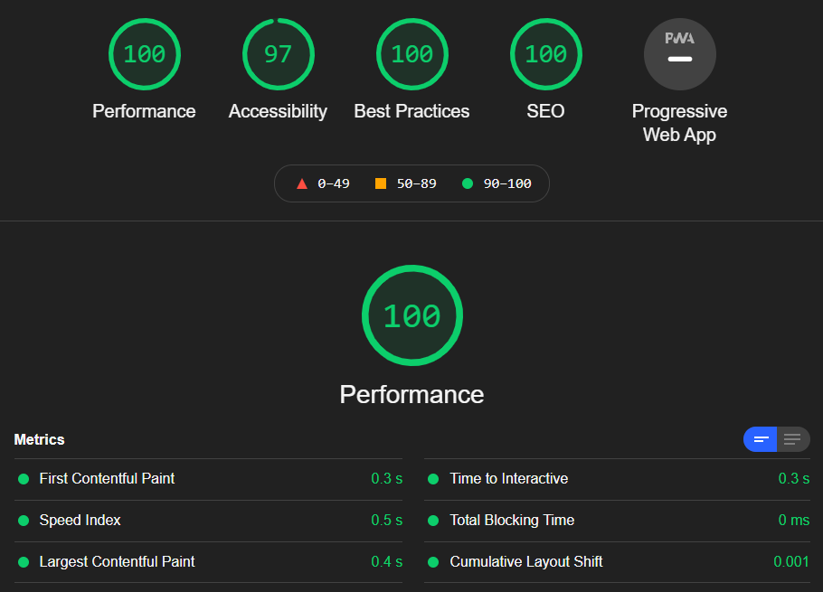

I woke up today at 09:00, wanting to get a lot more work on the website sorted. I was annoyed the mobile experience was crap. Materialize is good for many of things but it's grid system is crap. Thankfully CSS Grid has come to the rescue and it's something that I'm understood enough to be able to use. It's easier to use than some UI frameworks in my opinion. You gotta get your hands dirty. 

###Grid
I've refactored the code to remove Materialize for the UI placement. The only thing that currently stands are the styling the Nav/Footer. I'm not happy with how they're interacting with the site and I'd be happier being able to design it myself. More on this in the future. I'm sure I'll be using Grid for this. 

###CSS Modules
I've covered CSS modules in an eight minute video by [John Smilga](https://twitter.com/john_smilga). I'm currently following his GatsbyJS [Udemy](https://www.udemy.com/course/gatsby-tutorial-and-projects-course/) which I found to be absolutely invaluable. I was finding a lot of issues with conflicting CSS rules so to make it easier, I decided to dive deeper into CSS modules.

With CSS modules, rules are a lot easier to work with and naming isn't as tiresome. I'm still learning how to operate CSS modules correctly but for the most part, the website operates the way I've intended it to.

###Google Fonts
A bane when working with WordPress sites, I had to learn how to work with Google Fonts more effectively. Again, I remember within the GatsbyJS course, there was a section about prefetching Google fonts. Unfortunately since 2019, it's been discounted and so I used Google to find an alternative. Thankfully I came upon [gatsby-plugin-webfonts](https://www.gatsbyjs.com/plugins/gatsby-plugin-webfonts/) and it made the process so much simpler. I feel like I'm cheating when I download this plugin but it saves a lot of time. 

The plugin allows for the pre-fetching and local hosting of the fonts, meaning I don't have to use a HTTP call, slowing down the rendering of the site. It's locally hosted therefore users can download the files immediately. Handy!

I have to look at the contrasting with the hyperlinks on the site but apart from that, I'm fairly happy how everything has turned out today! The sight is snappy, things load up quickly and responsively and it doesn't look like crap on the mobile! Font looks great also. I'm loving this! 

I'm at the point that now it's about learning MDX. I'm worried that it'll break everything that I've worked very hard to get working correctly but I also know that I'll be able to fix it. The worries are starting to fade and that's why I started with this site. I can see the light at the end of the tunnel. It only took a kick up the arse to get sorted. 

Next I have to get the SEO meta information sorted on the site and learn more about how I can programmatically add Schema! 
